### Users of Car Sharing Platform

### Technologies Used

* Java 17
* Spring Boot 3.2.6
* Maven
* PostgreSQL (for dev/prod)
* H2 Database (for local/testing)

### How to Run

#### Prerequisites

* Java Development Kit (JDK) 17 or later
* Apache Maven


### Running from the Command Line

1.  Clone the repository from GitLab.
2.  Navigate to the project's root directory.
3.  Build the project using Maven:
    ```bash
    mvn clean package
    ```
4.  Run the application:
    ```bash
    java -jar target/DynamicCarSharing-1.0-SNAPSHOT.jar
    ```

The application will start and be accessible at `http://localhost:8080`.


---------------

* `Renter:` A user who wants to rent a car.
* `Car Owner:` A user who lists their car for rent.
* `Admin:` A system administrator who manages the platform.
* `Guest:` A non-registered user exploring the platform.
-------
#### User stories
**Format:** `As a [type of user], I want to [perform an action] so that [benefit or goal].`

------------------------
**Renter User Stories**
* As a renter, I want to browse available cars in my area so that I can choose one that fits my needs.
* As a renter, I want to filter cars by price, location, and type so that I can find the most suitable car quickly.
* As a renter, I want to book a car for a specific time period so that I can use it for my trip.
* As a renter, I want to view the car owner’s profile and ratings so that I can trust the person I’m renting from.
* As a renter, I want to make a secure payment through the platform so that I can complete my booking safely.
* As a renter, I want to receive a booking confirmation and car pickup details so that I know the process for accessing the car.
* As a renter, I want to rate and review the car and owner after my trip so that I can provide feedback for future users.
* As a renter, I want to filter cars by verification status so that I can ensure the car is trusted and reliable.
* As a renter, I want to file a dispute if there’s an issue with the car or booking so that I can seek resolution from the platform, with immutable dispute records.
* As a renter, I want to track my earnings, booking, and transaction history so that I can manage my rental activity and expenses.
------------------------
**Car Owner User Stories**
* As a car owner, I want to list my car on the platform so that I can earn money by renting it out.
* As a car owner, I want to set the availability and pricing for my car so that I can control when and how it’s rented.
* As a car owner, I want to review renter profiles before approving a booking so that I can ensure my car is in safe hands.
* As a car owner, I want to receive notifications about booking requests so that I can respond promptly.
* As a car owner, I want to track my earnings, booking, and transaction history so that I can manage my rental business effectively.
* As a car owner, I want to rate and review renters after a trip so that I can provide feedback for future owners.
* As a car owner, I want to submit my car for verification so that it can be listed as trusted on the platform.
* As a car owner, I want to manage my list of cars (add/remove) through the platform so that I can update my offerings, with updates handled by the system to maintain immutability.
* As a car owner, I want to update my contact information so that renters and the platform can reach me easily, with immutable contact records.
------------------------
**Admin User Stories**
* As an admin, I want to verify car owner profiles and vehicles so that I can ensure the platform’s safety and reliability.
* As an admin, I want to resolve disputes between renters and owners so that I can maintain a fair platform.
* As an admin, I want to monitor platform activity so that I can detect and prevent fraudulent behavior.
* As an admin, I want to manage user accounts (e.g., suspend or ban) so that I can enforce platform rules.
* As an admin, I want to view and manage reviews to ensure they meet platform guidelines so that users receive reliable feedback, with immutable review data.
* As an admin, I want to access detailed user and car data for reports so that I can improve platform operations.
------------------------
**Guest User Stories**
* As a guest, I want to view available cars without registering so that I can explore the platform before committing.
* As a guest, I want to sign up for an account so that I can start renting or listing cars.
* As a guest, I want to view car details, including type, price, and location, so that I can assess the platform’s offerings.
-------
#### OOD Class Diagram, Divide and conquer
1. `Cars Catalog:` Car, Location, CarRepository, LocationRepository, CarService, LocationService _(🔵Blue border color)_
2. `Users Management:` User, ContactInfo, UserRepository, ContactInfoRepository, UserService, ContactInfoService _(🟢Green border color)_
3. `Booking Management:` Booking, Payment, Transaction, Dispute, Review, CarReview, UserReview, BookingRepository, PaymentRepository, CarReviewRepository, UserReviewRepository, BookingService, PaymentService, CarReviewService, UserReviewService _(🔴Red border color)_
---------
### Prerequisites
1. Docker and Docker Compose installed.
2. Optional: DBeaver/pgAdmin for GUI-based database management.

### Setup Instructions
- Clone the Repository: `git clone git@gitlab.griddynamics.net:DynamicCarSharing.git`
- The SQL scripts in `initdb.sql` will create the schema if the database is empty.

### Edit .env if needed:
* DB_NAME=name_db
* DB_USER=username_db
* DB_PASSWORD=password_db
* DB_PORT=5432
* PGA_EMAIL=example@gmail.com
* PGA_PASSWORD=pgadmin_password
* PGA_PORT=5050

#### Start the Database, run Docker Compose: 
`docker-compose up -d`

#### Check the container is running:
`docker ps`

------------
### Connect using a database client (e.g., DBeaver):
#### Example with DBeaver:
* Host: localhost
* Port: 5432 (or DB_PORT from .env)
* Database: exampledb
* Username: exampleuser
* Password: examplepassword
--------
#### Example with pgAdmin
* URL: http://localhost:5050
* Email: example@gmail.com
* Password: root

**Add a server with:**
* Host: db (server name)
* Port: 5432
* Database: name-db
* Username: user
* Password: password
------
#### Stop the DatabaseTo stop without deleting data:
`docker-compose down`

#### To remove data:
`docker-compose down -v`

### Troubleshooting
Port Conflict: Check if 5432 is in use

--------------------------
1. Update DB_PORT in .env if needed.
2. Connection Issues: Verify container status (docker ps) and .env values.
3. Permission Errors: Ensure Docker is running, and I have access (sudo systemctl start docker).

### Statement vs Prepared Statement
#### Statement
* Used for simple SQL queries where the query is written as a full string.
* It is used when SQL query is to be executed only once.
* It is used for DDL statements.

**Disadvantages of Statement**
1. We need to build the query manually by adding user values to the string.
2. Vulnerable to SQL injection if user input is included directly: 
```java
String username = "admin";
String password = "' OR '1'='1"; // injected input

String query = "SELECT * FROM users WHERE username = '" + username + "' AND password = '" + password + "'";

Statement stmt = connection.createStatement();
ResultSet rs = stmt.executeQuery(query);

// Executes this vulnerable query: always returns true due to '1'='1', giving attackers access.
SELECT * FROM users WHERE username = 'admin' AND password = '' OR '1'='1'
```
3. Not efficient — the SQL query is compiled by the database every time.
4. Used to execute normal SQL queries.
5. Performance is very low.
--------
### Prepared Statement
* Used for parameterized queries (with ? placeholders instead of values).
* It is used when SQL query is to be executed multiple times.
* It is used for any SQL Query.

**Advantages**
1. Safe — protects against SQL injection.
```java
String username = "admin";
String password = "' OR '1'='1"; // same input

String query = "SELECT * FROM users WHERE username = ? AND password = ?";

PreparedStatement pstmt = connection.prepareStatement(query);
pstmt.setString(1, username);
pstmt.setString(2, password);

ResultSet resultSet = pstmt.executeQuery();

// Query is safe: user input is treated as dotenv, not part of the SQL command
SELECT * FROM users WHERE username = 'admin' AND password = '\' OR \'1\'=\'1'
```
2. Efficient — the query is compiled once and can be reused with different values.
3. Convenient — no need to manually build strings with values.
4. Used to execute dynamic SQL queries.
5. Performance is better than Statement.

#### Vulnerable Statement (printed with maliciousInput all user roles)
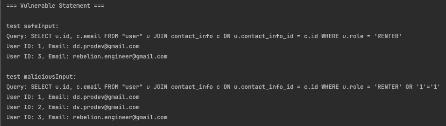

#### Secure PreparedStatement (didn't work)
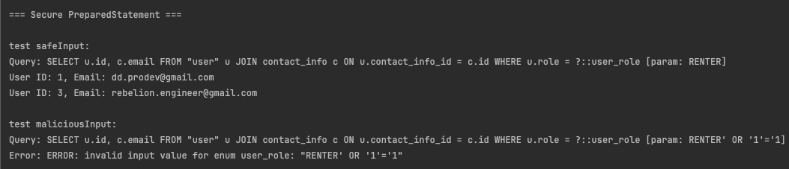

------
### Comparing Datasource and DriverManager
#### DriverManager
Advantages:
- Simple to use
- Good for small applications and quick tests

Disadvantages:
- No connection pooling (each call opens a new connection → slow)
- Not thread-safe
- Hard to maintain (credentials often hardcoded)
- Less suitable for large/enterprise systems

#### DataSource
Advantages:
- Supports connection pooling (performance boost)
- Easier to manage in large systems
- Can be integrated with application servers (e.g., JNDI)
- When using DataSource, we can centrally manage transaction settings, such as:
    - Auto-commit (default: true): Can be explicitly turned off to begin a manual transaction.
    - Transaction isolation level: Can be configured depending on the level of data consistency and concurrency I need.

Disadvantages:
- More complex to configure
- Requires additional setup (especially in standalone apps)

-------

### Comparing execute Methods in DatabaseUtil
#### A) `execute(String sql, Object... args)`

Pros:
- Concise and straightforward for simple DDL/DML queries.
- Automatically handles parameter binding with setObject.

Cons:
- Limited to setObject for parameter setting, restricting use of advanced JDBC types (e.g., arrays, custom types).
- No support for batch operations.

Use Case: Ideal for simple, one-off SQL statements where parameters are basic types (e.g., strings, numbers).

#### B) `execute(String sql, Consumer<PreparedStatement>)`
Pros:
- Provides full access to PreparedStatement, enabling batch operations, arrays, and advanced setters.
- Flexible for complex query requirements.

Cons:
- More verbose, requiring explicit PreparedStatement handling.
- Exposes JDBC API details to the caller, increasing complexity.

Use Case: Best for advanced scenarios requiring batch processing, custom types, or specific PreparedStatement configurations.

--------

### Performance Comparison: Single Connection (DataSource) vs Connection Pooling (Hikari)
**Single Connection (DataSource)**
* All threads share a single database connection. They will have to wait for the connection to be free, executing their queries sequentially.
* The total time will be roughly the sum of the individual query times. For 20 threads each sleeping for 1 second, the total time should be around 20 seconds.

**Connection Pool (Hikari)**
* Each thread requests a connection from the pool. With a pool size of 20, each thread can get its own connection and execute its query in parallel.
* The total time will be roughly the time of the longest query. For 20 threads each sleeping for 1 second, the total time should be just over 1 second.
-------
**Advantages of Connection Pooling**
* Improved Performance: Drastically speeds up applications by eliminating the high cost of creating a new database connection for every request.

* Resource Management: Prevents the database server from being overloaded by limiting and managing the number of concurrent connections.

* Increased Stability: Modern pools can test connections before use and handle dropped connections, making the application more resilient to network issues.

**Disadvantages of Connection Pooling**
* Configuration Complexity: Requires careful tuning of parameters (e.g., pool size, timeouts) to achieve optimal performance.

* Resource Overhead: The pool itself consumes application memory to hold open connections. An improperly sized pool can be wasteful.

* Connection State Risk: If a connection is returned to the pool in a bad state (e.g., with an unclosed transaction), it can cause unpredictable behavior when reused.
---------
### RDBMS Concepts
1. `ACID Consistency with Transactions` The 'C' in ACID stands for Consistency, which guarantees that any transaction will bring the database from one valid state to another. An operation that consists of multiple steps (e.g., creating a user and their contact info) must either complete entirely or fail entirely (rollback). If it only partially completes, the database is left in an inconsistent state. 
2. `Transaction Isolation Levels` Isolation determines how and when changes made by one transaction become visible to others. The default level in PostgreSQL is READ COMMITTED, which prevents one transaction from reading the uncommitted ("dirty") data of another.
2. `Single-Column Indexes` An index is a special lookup table that the database search engine can use to speed up data retrieval. Without an index, the database must perform a "Sequential Scan," reading every single row to find the data it needs. With an index, it can find the data much faster.
3. `Compound (Multi-Column) Indexes` A compound index is an index on two or more columns. The order of columns in the index definition is critical. PostgreSQL can use a compound index to satisfy queries that reference a prefix of the indexed columns (this is known as the "Left-Hand Prefix Rule").

Step 1-2:

`Running WITHOUT transaction...`

* The code: successfully inserted a new booking record into the database. Then, the program immediately "crashed" (threw a simulated error) before it could update the car's status to RENTED.
* Result: Car Status: AVAILABLE, Booking Count: 19
* Difference: The database is now in an inconsistent state. A booking exists for the car (the count went up by one), but the car is still listed as AVAILABLE. Another user could try to book this already-booked car. This is a serious data error.

`Running WITH transaction...`
* The code: started a transaction. It inserted the new booking, and then the program "crashed" in the same way. However, the catch block executed connection.rollback().
* Result: Car Status: AVAILABLE, Booking Count: 0
* Difference: The rollback command acts like an "undo" for everything that happened inside the transaction. It erased the new booking as if it never happened. The database is left in a perfectly consistent state. This is the core purpose of a transaction: to guarantee that a set of operations either all succeed or all fail together.


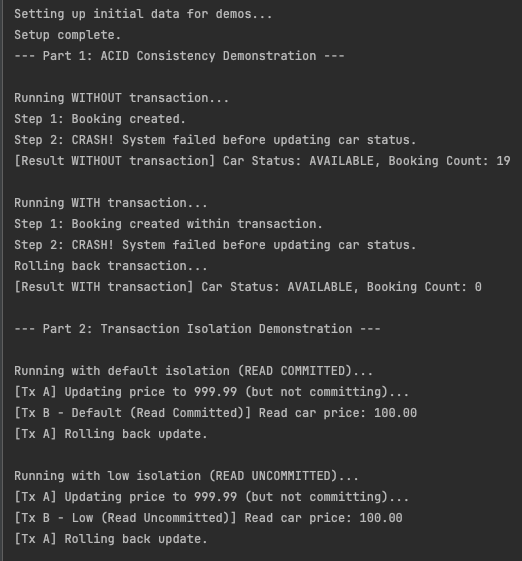

Step 3-4:
`Running with default isolation (READ COMMITTED)...`

* The code: transaction A updated a car's price to 999.99 but did not commit the change. While it was paused, Transaction B (using the default READ COMMITTED level) tried to read the price.
* Result: Transaction B read the car price as 100.00.
* The Difference: It read the original, committed price. It was not allowed to see the "dirty" (uncommitted) change that Transaction A was holding. This is the safe, default behavior.

`Running with low isolation (READ UNCOMMITTED)...`
* The code: same scenario ran, but this time Transaction B was set to a lower, less safe isolation level: READ UNCOMMITTED.
* Result: Transaction B read the car price as 100.00.
* Difference: You might expect it to read 999.99 (the dirty data). However, PostgreSQL is safer than other databases. For this specific case, it automatically upgrades READ UNCOMMITTED to behave exactly like READ COMMITTED. It does not allow dirty reads.


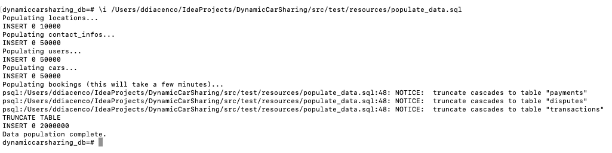

`Single-Column Index Test`

* Test WITHOUT index

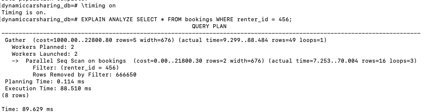

* Create the index

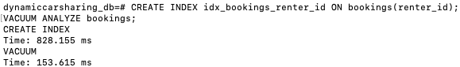

* Test WITH index

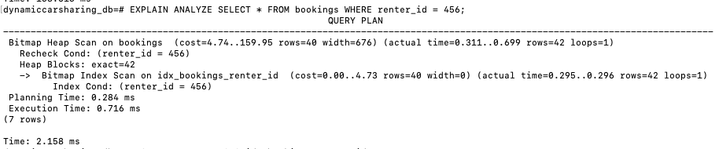


`Compound Index Test`

* Clean up previous index and prepare for new test

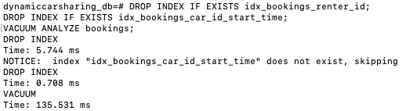

* Create the compound index

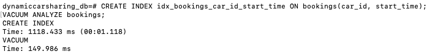

* Test with full prefix (car_id and start_time)

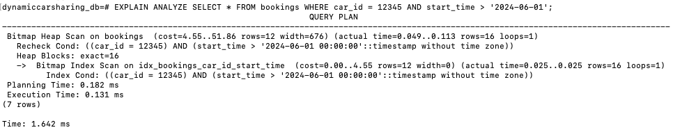
* Test with left-prefix only (car_id)

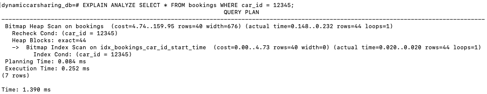

* Test with non-prefix column (start_time)

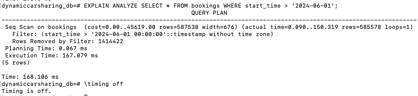

### JPA Lifecycle Experiments (Difference)
This information is explanation of key behaviors under various conditions: 

1. `repository.save()`, 
2. `entityManager.persist()`, 
3. `entityManager.merge()`

```dotenv
--- 3. Saving a New Parent (without an ID) ---

3.1 repository.save(newUser): Works perfectly. Spring Data JPA detects the null ID and calls persist() behind the scenes, generating an INSERT.

3.2 entityManager.persist(newUser): Works perfectly. This is the core JPA method for making a new object persistent. It generates an INSERT.

3.3 entityManager.merge(newUser): Works. merge on a new object also results in an INSERT. The key difference is that merge returns a new, managed instance, while the original object remains detached.

Conclusion: For new entities, repository.save() and entityManager.persist() are the most direct approaches.
```

```dotenv
--- 4. Saving a Parent with a Pre-assigned ID ---

4.1 repository.save(userWithId): Works. Spring Data JPA sees the non-null ID, assumes it's a detached entity, and calls merge(). This results in a SELECT to check for existence, followed by an INSERT.

4.2 entityManager.persist(userWithId): FAILS. The persist method is strictly for new entities without an ID. It throws a PersistenceException because the entity is considered "detached," not new.

4.3 entityManager.merge(userWithId): Works. This is the same behavior as repository.save(), resulting in a SELECT then an INSERT.

Conclusion: persist() cannot be used on objects that already have an ID. repository.save() is a safe wrapper around merge() in this case.
```

```dotenv
--- 5. Saving a Parent with a Conflicting ID ---

5.1 repository.save(conflictingUser): Works. It calls merge(), finds the existing record by its ID, and performs an UPDATE, overwriting the old data.

5.2 entityManager.persist(conflictingUser): FAILS. It throws a PersistenceException because I cannot persist a new entity with a primary key that already exists in the database.

5.3 entityManager.merge(conflictingUser): Works. This is the classic use case for merge. It finds the existing record and performs an UPDATE.

Conclusion: merge() (and by extension, repository.save()) is the correct way to update an existing record's state from a detached object.
```

```dotenv
--- 6. Saving a Parent with New (Transient) Children ---

The Result: All three approaches (save, persist, merge) will only save the Parent and will NOT save the Children.

Why?: Although the Parent's List<UserReview> was updated in memory, the UserReview object itself did not have its user field set. Because UserReview is the owning side of the relationship (it has the @JoinColumn), JPA only looks at the user field on the UserReview object to determine the relationship. Since it's null, no link is created.

Conclusion: For bidirectional relationships, the owning side of the relationship must be set for persistence to cascade correctly.
```

```dotenv
--- 7. Saving a Parent with Existing (Persistent) Children ---

The Result: All three approaches work as expected.

Why?: The child (UserReview) already exists in the database with a valid foreign key (user_id). The operations on the parent do not need to cascade any changes to the already-persistent child.
```

```dotenv
--- 8. Saving a Child without a Parent ---

The Result: All three approaches FAIL.

Why?: UserReview entity has @JoinColumn(name = "user_id", nullable = false). The database has a NOT NULL constraint on the user_id column. The operation fails at the database level because JPA tries to execute an INSERT statement with a NULL foreign key.
```

```dotenv
--- 9. Saving a Child with a New (Transient) Parent ---

The Result: All three approaches FAIL.

Why?: I'm trying to save a UserReview and link it to a User that does not yet exist in the database. This violates the foreign key constraint (fk_user_reviews_on_users_user), as the user_id I'm trying to insert does not exist in the users table.
```

```dotenv
--- 10. Saving a Child with a Detached Parent. ---

The Result: All three approaches SUCCEED.

Why?: The parent object, although detached from the current session, has a valid ID that exists in the database. When I save the child, JPA can see the ID from child.getUser().getId() and correctly inserts the user_id foreign key.
```

```dotenv
--- 11. Changing a Detached Entity (No @Transactional) ---

The Result: The changes are NOT saved to the database.

Why?: When I fetch an entity using userRepositoryJdbcImpl.findById(), the transaction for that operation closes immediately. The returned object becomes detached. Any changes I make to this object are just changes to a regular Java object in memory; JPA is no longer tracking it.
```

```dotenv
--- 12. Changing a Managed Entity (With @Transactional) ---
    
The Result: The changes ARE saved to the database, even without calling save().

Why?: Inside a transaction, any entity I fetch is managed. JPA tracks this object for changes. When the transaction commits, JPA performs "dirty checking," sees that the role was modified, and automatically generates and executes an UPDATE statement. This is a core feature of an ORM.
```
