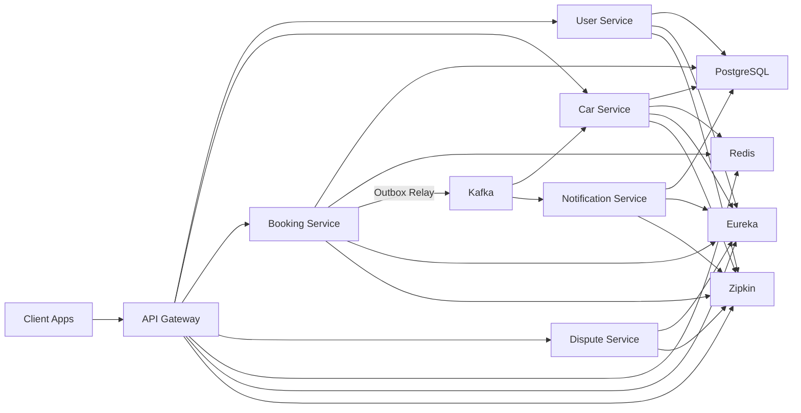

# Car Sharing Platform - Production-Style Microservices Backend

A distributed backend platform for car sharing built with Spring Boot and Spring Cloud.
It simulates real production concerns: service boundaries, asynchronous workflows, reliability patterns, observability, and consistency under concurrent load.

## Highlights

- Microservices architecture (Spring Boot + Spring Cloud + API Gateway + Eureka)
- Kafka event-driven communication with transactional outbox pattern
- Redis caching in gateway/services plus idempotency and concurrency guard
- Booking/payment flows designed to prevent double-processing and race issues
- Anti-fraud analytics pipeline in `notification-service`
- Distributed tracing (Zipkin), metrics (Prometheus/Grafana), centralized logs (ELK)
- Optimistic locking for conflict-safe concurrent updates
- Integration-test-first validation across service boundaries

## Architecture



### How it works (high level)

- Client traffic enters through the API Gateway, where auth and routing are centralized.
- Core domain services (`user`, `car`, `booking`, `dispute`) remain independently deployable.
- Booking lifecycle events are stored in DB and published to Kafka via transactional outbox.
- Consumers (`car-service`, `notification-service`) process events asynchronously and idempotently.
- Redis accelerates read-heavy paths and supports idempotency/locking in critical flows.

## Engineering Challenges

- Preventing double booking under concurrent requests (locking + validation + status transitions)
- Reliable event delivery from DB transaction to broker (transactional outbox)
- Idempotent payment and booking-related operations for retry-safe behavior
- Handling eventual consistency between services after async events
- Balancing performance and correctness with targeted cache invalidation

## My Contribution

- Designed and implemented booking lifecycle with robust status transition rules.
- Implemented Kafka integration with transactional outbox in `booking-service`.
- Added Redis-based idempotency and concurrency safeguards for critical flows.
- Built anti-fraud event-processing pipeline in `notification-service`.
- Implemented optimistic locking for conflict-safe updates.
- Added gateway response caching and invalidation strategy for read-heavy endpoints.
- Strengthened reliability via integration tests across service and infrastructure boundaries.

## Tech Stack

- **Backend:** Java 17, Spring Boot, Spring Cloud, Spring Security, Spring Data JPA, Maven
- **Data:** PostgreSQL, Redis, H2 (tests)
- **Messaging:** Apache Kafka
- **Observability:** Prometheus, Grafana, Elasticsearch, Logstash, Kibana, Zipkin
- **Infra:** Docker, Docker Compose

## Quick Start

### Prerequisites

- Java 17
- Maven
- Docker
- Docker Compose

### Run full platform

```bash
git clone https://github.com/DiacencoDumitru/car-sharing-platform.git
cd car-sharing-platform
cp .env.example .env
```

Fill required values in `.env` (`JWT_SECRET`, `USER_SERVICE_INTERNAL_API_KEY`, DB and Grafana credentials), then:

```bash
docker compose up --build
```

## How to Verify

```bash
# run all integration tests
mvn test

# run booking-focused suite
mvn test -pl services/booking-service -am

# run notification Kafka flow tests
mvn test -pl services/notification-service -am
```

Then open key services:

- API Gateway: `http://localhost:8085`
- Eureka: `http://localhost:8761`
- Prometheus: `http://localhost:9090`
- Grafana: `http://localhost:3000`
- Kibana: `http://localhost:5601`
- Zipkin: `http://localhost:9411`

## Key Endpoints

Only representative public endpoints are shown here:

- `POST /api/v1/bookings` - create booking
- `PATCH /api/v1/bookings/{id}` - approve/complete/cancel booking
- `POST /api/v1/bookings/{bookingId}/payment` - create payment for booking

## Why This Project

This project demonstrates production-style backend engineering beyond CRUD:

- distributed domain boundaries
- asynchronous event processing
- reliability patterns (outbox, idempotency)
- observability-first operations
- concurrency-safe business logic

It is intentionally designed as an interview-ready system to discuss trade-offs in distributed architecture, consistency, and scalability.

## Project Structure

- `services/` - runnable microservices and edge components
  - `api-gateway`
  - `user-service`
  - `car-service`
  - `booking-service`
  - `notification-service`
  - `dispute-service`
  - `eureka-server`
- `shared/` - shared contracts and utilities
- `infrastructure/` - observability configs used by Docker Compose
- `infra/` - Terraform assets

## Author

Dumitru Diacenco, Java Backend Engineer
